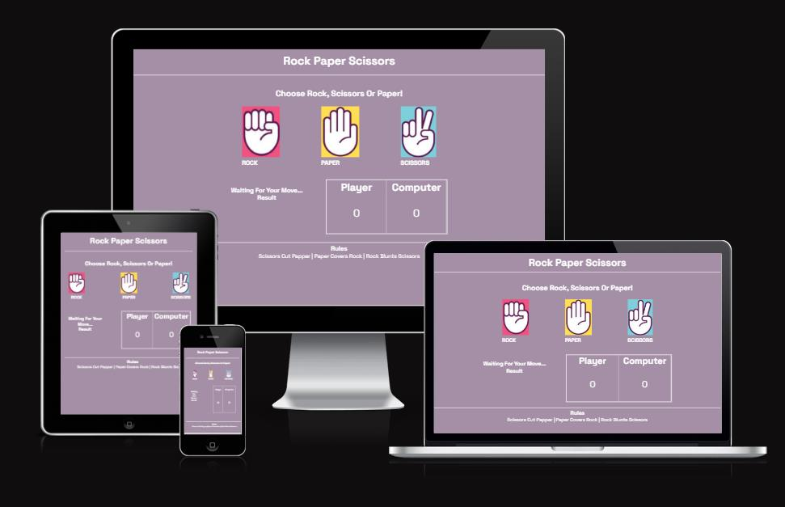
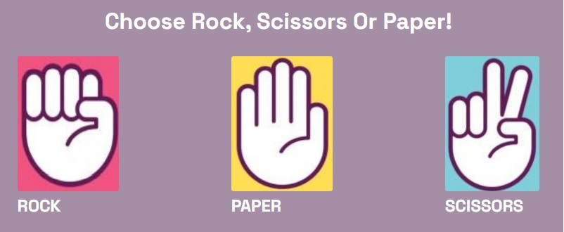
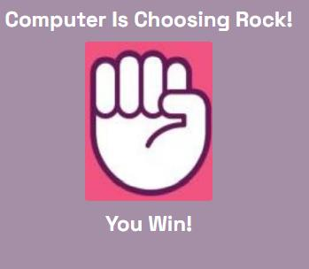
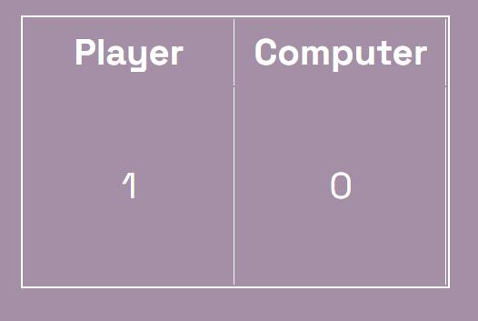
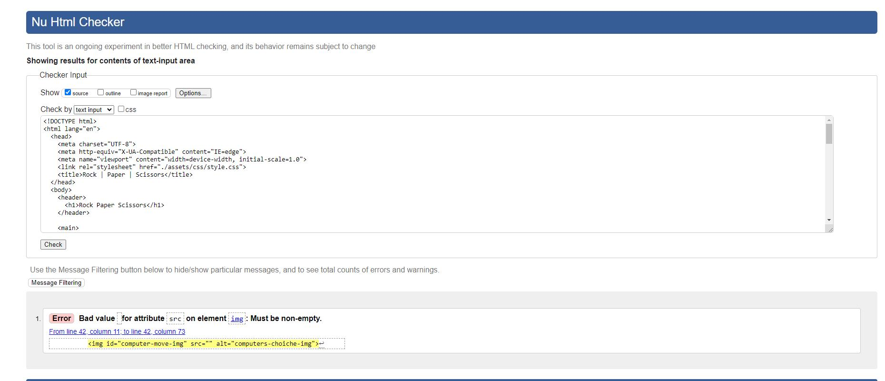
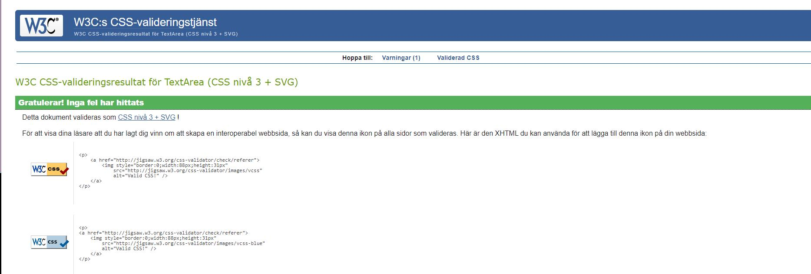
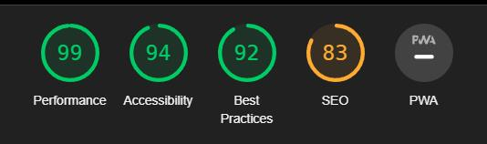
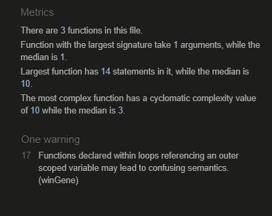

# Rock, Scissors and Paper

[Link to Live Website](https://oskarj1993.github.io/Scissors--paper-and-rock/)

Rock, Scissors and Paper is a classic game, built using basic JavaScript. User will pick scissors, paper or rock and computer will pick one.

The rules of the game is like the original:
- Rock beats scissors.
- Paper beats rock.
- Scissors beat paper.

## Features

### __Selection For User__
 - Here can user pick Rock, Scissors and Paper. 

### __Computer is Choosing And Showing Who Wins__
 - In This Area Shows What Computer Choose And Showing Who Wins.
 
 
 

### __Scoreboard Area__
 - Here it Shows how many points the user and computer has.
 
 
 

## Future Features

- Timer

## Wireframes

Click [here](https://www.figma.com/file/P8xZBBcfRXOf2HSx5JIGaD/Untitled?node-id=0%3A1&t=MFMBP8rUwQYqY6o8-0) to go to Figma. 

## Technology

- HTML5
- CSS3
- JavaScript
- GitHub
- Google Fonts

## Testing 

#### Browser testing

- I have tested that the site works on Windows computer and Macos laptop.
- The site work with following browsers for desktop: Chrome, Safari and Firefox.
-  The site has been tested with Android and Ios handheld using: Chrome, Safari and Firefox.

#### Responsive testing

- Using Chrome developer tools the site has been tested with responsiveness.
- Using Chrome developer tools the site has been tested with small screens (Iphone 4) to very large screens up to 5k.
### Code Validation

- The site will be tested using W3C Markup Validator, W3C Css Validator, LightHouse and JsHint.

#### W3C Markup Validator
- Html Validator is showing one error coused by img src is not decleared. But it is declered in JavaScript.

 - Here is a screenshot of result.
 
 
 

#### W3C Css Validator
 - Here is a screenshot of result.
 
 
 

#### LightHouse test
 - Here is a screenshot of result.
 
 
 

 #### JsHint validator
  - Here is a screenshot of result.
 
 
 

 ### Functionallity Test

| ID | Test Label | Test Action | Expected Outcome | Test Outcome |
|----|------------|--------------------------------|--------------|------------------
| 1 | Landing page / Welcome page | User enters site | Presentation for user to play | PASS |
| 2 | Game area | User clicks on one of the pictures/buttons to start the game  | Computer will randomly choose Rock, Paper or Scissors | PASS |
| 3 | Result | Who wins text | The text of who wins or if it is tie the game will appear | PASS |
| 4 | Score Board | The winner will get one point | The winner gets one point printed on the score board | PASS |

## Deployment

The website will be deployed using the following methods:

### Via Github pages:

- Open GitHub repository and open the settings tab

- From settings navigate to pages tab

- Under branch, select the main branch through the dropdown menu

- Once selected and saved, the page will be refreshed (in case of nothing happening wait for a couple muinites and refresh page manually)

- The refreshed page will show a detailed ribbon containing the website link and indicate a successful deployment.

### Forking
Forking the GitHub Repository

By forking the GitHub Repository, you can make a copy of the original repository in your own GitHub account. This means we can view or make changes without making the changes affecting the original.

Log into GitHub and locate the GitHub Repository.
At the top of the Repository there is a "Fork" button about the "Settings" button on the menu.
You should now have a new copy of the original repository in your own GitHub account.

### Cloning
Making a Local Clone

Log into your GitHub then find the gitpod repository

Under the repository name there is a button that says "Clone or download". Click on this button.

If cloning with HTTPS "Clone with HTTPS", copy this link.

Open Gitbash

Change the current working directory to the location where you want the cloned directory to be.

Type git clone, and then paste the URL you copied earlier.

## Credits 

- [Google Fonts](https://fonts.googleapis.com/css2?family=Space+Grotesk:wght@400;700&display=swap)

- [Stackoverflow](https://stackoverflow.com/) On stackoverflow I could find answers for every problem I had.

- Extra credit to my mentor at codeinstitute for giving advice and good feedback.